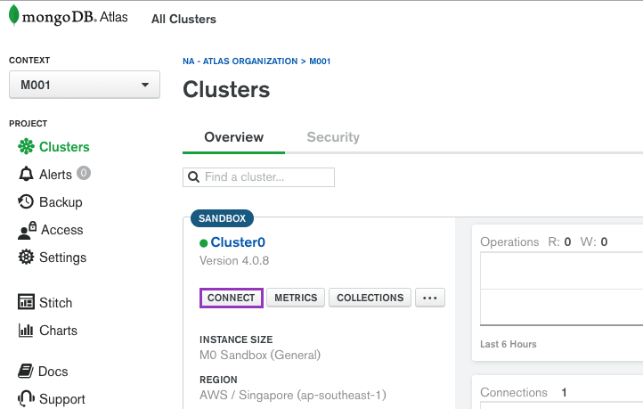
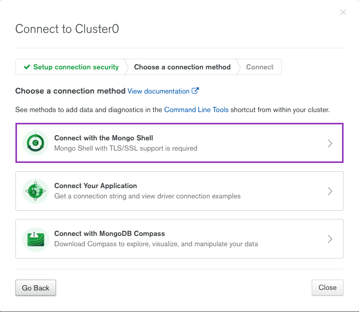
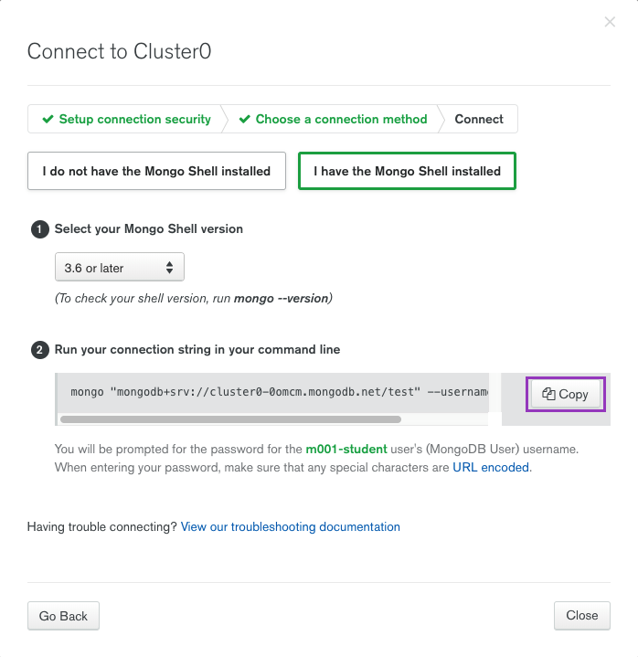

## 问题

1. If you have not already loaded the **`video.movieDetails`** collection, please review the lesson "Loading Data into Your Sandbox Cluster" for a tutorial. Then, use the script, **`loadMovieDetailsDataset.js`**, provided in the handouts for the lesson, "Connecting to an Atlas Cluster from the Mongo Shell" to load the **`movieDetails`** collection.
2. Use Compass to connect to your sandbox cluster.
3. In Compass, view the video.movieDetails collection and apply the filter **`{genres: "Comedy"}`**.

How many documents in video.movieDetails match the filter **`{genres: "Comedy"}`**?

```
[ ] 457
[ ] 558
[ ] 603
[ ] 749
[ ] 816
```

## 解析

解答分为三步：

1. 使用 Mongo Shell 连接[Lab 2.0](/2019/04/18/0020-m001-lab2.0)创建的 MongoDB Atlas 集群
2. 加载数据
3. 构造查询命令，获得答案

使用 Mongo Shell 连接 MongoDB Atlas 集群需要获得集群的 URI：







```bash
# path=0021-m001-lab2.1
$ mongo <copied-mongo-uri>
```

登录时需要用到[Lab 2.0](/2019/04/18/0020-m001-lab2.0)设置的账号密码。

在 Mongo Shell 中，导入数据：

```
> load("loadMovieDetailsDataset.js")
```

无需担心此前是否已经加载过数据，`loadMovieDetailsDataset.js`在导入之前会清空目标数据库`video`中的`movieDetails` collection：

```js
db = db.getSiblingDB("video");
db.movieDetails.drop();
db.movieDetails.insertMany([
  // ...
]);
```

执行满足题目要求的查询命令：

```js
> use video
> db.movieDetails.count({ genres: "Comedy" })
749
```

## 答案

```
[ ] 457
[ ] 558
[ ] 603
[X] 749
[ ] 816
```
